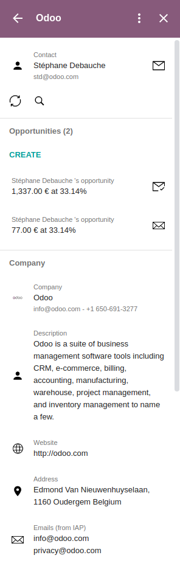

# Odoo Gmail Add-on
This addons allows you to find information about the sender of the emails you received
and also to link your Gmail contacts to your Odoo partners, to create leads from Gmail,...

# Development
## Installation
First you need npm,
> apt-get install -y npm

We use [clasp](https://github.com/google/clasp) to push the project on the Google platform
> npm install -g @google/clasp

Project dependencies
> npm install --dev @types/google-apps-script

## Clasp
Login to your account to be able to push on your Gmail project,
> clasp login --no-localhost

Open your Gmail project
> clasp open

Enable the Gmail API
> clasp apis enable gmail

Automatically push the project when a changed is detected
> clasp push --watch

## Prettier
You should auto-format the code using the prettier configuration,
> `npx prettier --config .prettierrc 'src/**/*.ts' --write`

## Install the add-on on your Gmail account
1. Share the google project to your Gmail account
2. Then go to "Publish" -> "Deploy from manifest" and click on "Install the add-on"

# Documentation
`GmailApp` object,
https://developers.google.com/apps-script/reference/gmail/gmail-app

`URL fetch API`
https://developers.google.com/apps-script/reference/url-fetch

`Storage`
https://developers.google.com/apps-script/reference/cache
https://developers.google.com/apps-script/reference/properties
